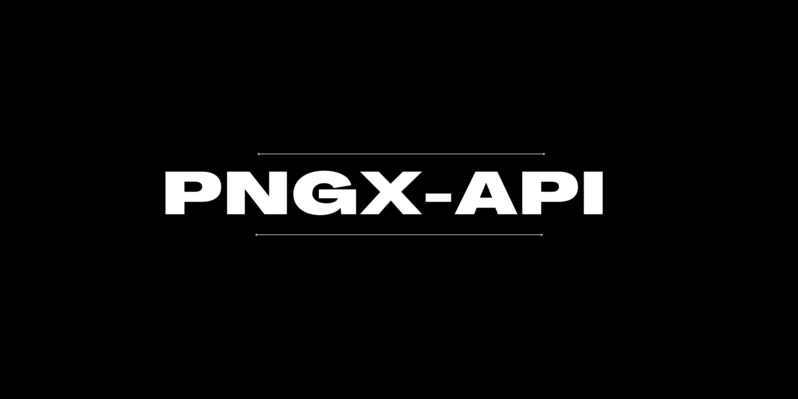

[](https://github.com/chrisaugu/nuku-api)

# NUKU API

NUKU API (formerly PNGX-API) is a Node.js service for accessing Papua New Guinea stock market data. It collects and serves company, ticker, quote, historical, news, and market information through REST, GraphQL, and real-time interfaces.

- **REST API:** `/api/v2`
- **GraphQL:** `/graphql`
- **Server-Sent Events:** `/events`
- **WebSocket:** `/ws`
- **Interactive API docs:** `/api/docs`

The API's OpenAPI source is in [`docs/openapi.yaml`](docs/openapi.yaml); the longer documentation site is in [`docs/`](docs/README.md).

## Getting started

### Requirements

- Node.js in one of the supported ranges: `>=20.19.0 <21`, `>=22.13.0 <23`, or `>=24.11.0 <25`
- MongoDB
- Redis for health checks and real-time event streams

### Run locally

```sh
git clone https://github.com/chrisaugu/nuku-api.git
cd nuku-api
npm install
cp .env.example .env
```

Set `PORT`, `MONGODB_URI`, and `REDIS_URL` in `.env` to values for your environment. `REDIS_BACKEND_URL` can be set separately when using a distinct Redis backend. The application loads `.env` at startup.

Start the server:

```sh
npm run dev
```

The server uses the configured port. For example, with `PORT=5000`, visit `http://localhost:5000/api/v2/` or open the interactive reference at `http://localhost:5000/api/docs`.

To run the production entry point:

```sh
npm start
```

### Docker

The included Docker image listens on port `5000`. Configure MongoDB and Redis for the container through environment variables, then build and start it:

```sh
docker build -t nuku-api .
docker run --rm -p 5000:5000 \
  -e MONGODB_URI='mongodb://host.docker.internal:27017/nuku' \
  -e REDIS_URL='redis://host.docker.internal:6379' \
  nuku-api
```

The checked-in Compose file builds the API container; its database and Redis service definitions are currently commented out, so provide those services separately.

## API overview

Unless otherwise noted, REST endpoints are under `/api/v2`. Use the interactive docs at `/api/docs` for the deployed operation schemas and request details. The API currently uses PNGX ticker symbols; a list is returned by `GET /api/v2/tickers`.

| Method | Endpoint                               | Purpose                                                                                            |
| ------ | -------------------------------------- | -------------------------------------------------------------------------------------------------- |
| `GET`  | `/api/v2/`                             | API welcome response and ticker codes                                                              |
| `GET`  | `/api/v2/health`                       | API and Redis health check                                                                         |
| `GET`  | `/api/v2/tickers`                      | List ticker symbols                                                                                |
| `GET`  | `/api/v2/tickers/:code`                | Look up a ticker                                                                                   |
| `GET`  | `/api/v2/companies`                    | List companies                                                                                     |
| `GET`  | `/api/v2/companies/:code`              | Look up a company                                                                                  |
| `GET`  | `/api/v2/stocks`                       | Get available stock records                                                                        |
| `GET`  | `/api/v2/stocks/:code`                 | Get stock information by code                                                                      |
| `GET`  | `/api/v2/stocks/:code/:date`           | Get a quote for a trading date (`YYYY-MM-DD`)                                                      |
| `GET`  | `/api/v2/stocks/:code/prices`          | Get price history; supports `start`, `end`, `period`, `limit`, `sort`, and `skip` query parameters |
| `GET`  | `/api/v2/historicals/:code`            | Get historical records                                                                             |
| `GET`  | `/api/v2/historicals/:code/essentials` | Get selected historical fields                                                                     |
| `GET`  | `/api/v2/news`                         | Get news items                                                                                     |
| `GET`  | `/api/v2/news/sources`                 | List news sources                                                                                  |
| `GET`  | `/api/v2/market/status`                | Get market status                                                                                  |
| `GET`  | `/api/v2/market/holidays`              | Get market holidays                                                                                |
| `GET`  | `/api/v2/indices`                      | List market indices                                                                                |
| `GET`  | `/api/v2/indices/:code`                | Get an index by code                                                                               |
| `GET`  | `/api/v2/batch/:symbols`               | Request data for multiple symbols                                                                  |
| `GET`  | `/api/v2/lookup/:symbol`               | Look up a symbol                                                                                   |
| `GET`  | `/api/v2/chart/:symbol/:range`         | Get chart data                                                                                     |

The older `/api/v1` routes remain available for compatibility and are deprecated. Check `/api/docs` and [`routes/v2.js`](routes/v2.js) for current parameters, response shapes, and additional operations. Dates should be supplied as ISO 8601 dates where a date is expected.

### Example requests

```sh
curl http://localhost:5000/api/v2/health
curl http://localhost:5000/api/v2/tickers
curl 'http://localhost:5000/api/v2/stocks/BSP/prices?start=2025-01-01&end=2025-12-31'
curl http://localhost:5000/api/v2/stocks/BSP/2025-05-29
```

### GraphQL

Send GraphQL requests to `/graphql`. For example:

```graphql
query {
  __typename
}
```

The available schema and quote queries are defined in [`graphql/typeDefs.js`](graphql/typeDefs.js) and [`graphql/`](graphql/).

### Server-Sent Events

Connect to `/events` and provide comma-separated topic names in the `topics` query parameter. For example:

```sh
curl -N 'http://localhost:5000/events?topics=tickers:BSP'
```

Events are delivered as standard SSE messages, with the topic as the event name. Redis must be available for event subscriptions.

## Configuration

Copy [`.env.example`](.env.example) to `.env`. Common settings include:

| Variable                   | Purpose                                                      |
| -------------------------- | ------------------------------------------------------------ |
| `PORT`                     | HTTP port for the API                                        |
| `HOST`                     | Host/interface to bind                                       |
| `NODE_ENV`                 | Runtime environment (`development`, `production`, or `test`) |
| `MONGODB_URI`              | MongoDB connection URI                                       |
| `REDIS_URL`                | Redis connection URL                                         |
| `REDIS_BACKEND_URL`        | Optional separate Redis backend URL                          |
| `UPSTASH_REDIS_URL`        | Optional Upstash Redis URL                                   |
| `UPSTASH_REDIS_REST_URL`   | Optional Upstash REST URL                                    |
| `UPSTASH_REDIS_REST_TOKEN` | Optional Upstash REST token                                  |
| `API_KEY`, `API_SECRET`    | API credentials for integrations that use them               |
| `WEBHOOK_TOKEN`            | Webhook verification token                                   |
| `MAX_TIME_DIFFERENCE`      | Allowed webhook timestamp difference                         |
| `LOG_LEVEL`, `LOG_FORMAT`  | Logging configuration                                        |
| `LOG_FILE`, `LOG_DIR`      | Log file and directory settings                              |

Keep credentials out of source control. Some integrations and background jobs may require additional environment-specific setup.

## Development

Useful scripts:

```sh
npm run dev          # Start with nodemon
npm start            # Start the API server
npm run lint          # Run ESLint
npm run test          # Run Jest tests
npm run test:unit     # Run unit tests
npm run test:integration
npm run test:e2e
npm run docs          # Serve the docsify documentation site
```

Please read [`CONTRIBUTING.md`](CONTRIBUTING.md) before submitting a change. Bug reports and feature requests can be filed in the [GitHub issue tracker](https://github.com/chrisaugu/nuku-api/issues).

## License

NUKU API is released under the [MIT License](LICENSE). Copyright © Christian Augustyn.

## Author

Created by [Christian Augustyn](https://github.com/chrisaugu).
